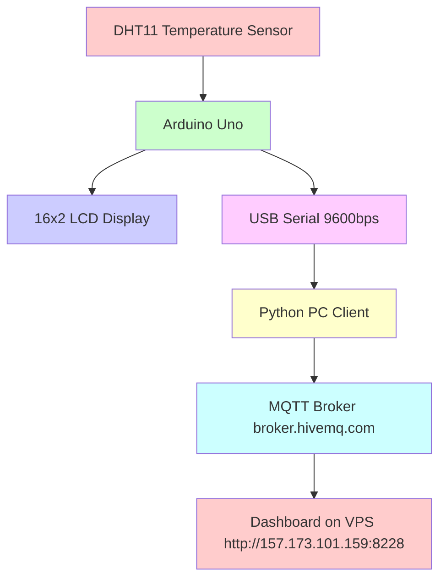

# Temperature Display and MQTT Monitoring

A complete embedded system for temperature monitoring using Arduino, LCD, PC Client, and MQTT Broker.

## Live Dashboard
The dashboard is deployed on a VPS and available at:
[http://157.173.101.159:8228/](http://157.173.101.159:8228/)

## System Architecture



## Project Structure
```
DHT-MQTT-DISPlAY/
├── arduino/
│   └── DHT_Temperature_LCD/
│       └── DHT_Temperature_LCD.ino
├── pc-client-python/
│   ├── index.py
│   └── requirements.txt
├── pc-client-nodejs/
│   ├── index.js
│   ├── package.json
│   └── package-lock.json
├── ui/
│   └── index.html
├── PROCESS.md
└── README.md

```

## Part 1: Arduino Setup

### Components Required
- Arduino Uno
- DHT11 Temperature Sensor (3-pin)
- 16x2 I2C LCD Display
- Breadboard and Jumper Wires

### Wiring

#### 1. DHT11 Sensor (3-pin)
| DHT11 Pin | Arduino Uno Pin |
|-----------|-----------------|
| VCC       | 5V              |
| GND       | GND             |
| DATA      | Digital Pin 2   |

#### 2. I2C LCD Display
| LCD Pin | Arduino Uno Pin |
|---------|-----------------|
| VCC     | 5V              |
| GND     | GND             |
| SDA     | A4 (SDA)        |
| SCL     | A5 (SCL)        |

### Required Arduino Libraries
Install these via Arduino Library Manager:
- `DHT sensor library` by Adafruit
- `Adafruit Unified Sensor`
- `LiquidCrystal I2C` by Frank de Brabander

### Code
The Arduino sketch is in `arduino/DHT_Temperature_LCD/DHT_Temperature_LCD.ino`. Don't forget to:
1. Set your candidate name in the code
2. Verify your LCD I2C address (common addresses: 0x27 or 0x3F)

## Part 2: PC Client Setup (Python)

### Installation
```bash
cd pc-client-python
pip install -r requirements.txt
```

### Configuration
Update the following in `pc-client-python/index.py`:
- `SERIAL_PORT`: Your Arduino's COM port (e.g., COM10 on Windows)
- `MQTT_BROKER`: broker.benax.rw (already set)
- `MQTT_PORT`: 1883 (already set)
- `MQTT_TOPIC`: temperature/sensor_data_prince (already set)

### Running the Client
```bash
py index.py
```

**Note**: Make sure no other program (like Arduino IDE Serial Monitor) is using the same COM port!

## Part 3: Dashboard Setup

The dashboard is a simple HTML page located in `ui/index.html`.
To use it:
1. Open `ui/index.html` in your browser
2. The dashboard will connect to broker.hivemq.com automatically
3. It shows real-time temperature data and recent history!

## Communication Details

- **Serial Communication**: Between Arduino and PC at 9600 baud
- **MQTT Broker**: broker.hivemq.com
- **MQTT Port**: 1883
- **MQTT Topic**: temperature/sensor_data_prince
- **MQTT Websocket Port (for dashboard): 8884

**Visit [PROCESS.md]/(./PROCESS.md) to see how everyting ws made togehter with screenshots**
